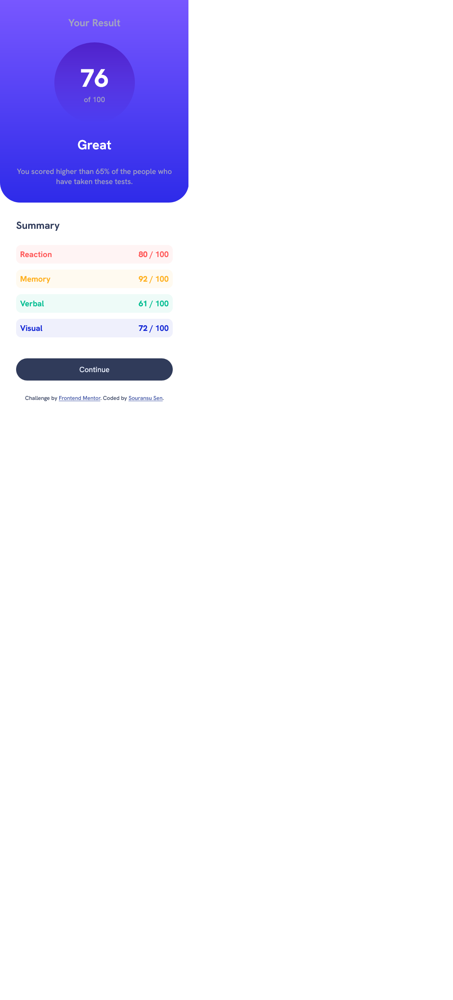
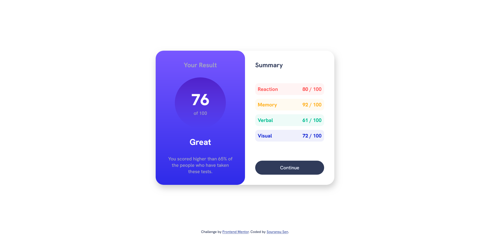

# Frontend Mentor - Results summary component solution

This is a solution to the [Results summary component challenge on Frontend Mentor](https://www.frontendmentor.io/challenges/results-summary-component-CE_K6s0maV). Frontend Mentor challenges help you improve your coding skills by building realistic projects.

## Table of contents

- [Overview](#overview)
  - [The challenge](#the-challenge)
  - [Screenshot](#screenshot)
  - [Links](#links)
- [My process](#my-process)
  - [Built with](#built-with)
  - [What I learned](#what-i-learned)
  - [Continued development](#continued-development)
  - [Useful resources](#useful-resources)
- [Author](#author)
- [Acknowledgments](#acknowledgments)

## Overview

### The challenge

Users should be able to:

- View the optimal layout for the interface depending on their device's screen size
- See hover and focus states for all interactive elements on the page

### Screenshot

### Links

- Solution URL: [GitHub](https://github.com/FinalRain7751/frontendmentor/tree/results-summary-component-main)
- Live Site URL: [Netlify](https://gleaming-kheer-e19fb4.netlify.app/)

## My process

- First, I chalked out the layout and what to use (Grid, Flexbox) to get it done correctly.
- Then I set up all the custom properties (P.S. I love working with custom properties.)
- Then the CSS was not that difficult.

### Built with

- Semantic HTML5 markup
- CSS custom properties
- Flexbox
- CSS Grid
- Mobile-first workflow

### What I learned

Reinforced my learnings of CSS.

### Continued development

I need improvement in the areas of accessibikity, handling images and videos and most importantly working with a pre-processor.

### Useful resources

- Kevin Powell - Do check out his courses on CSS.
- MDN.

## Author

- Frontend Mentor - [@FinalRain7751](https://www.frontendmentor.io/profile/FinalRain7751)

## Acknowledgments

All me.
