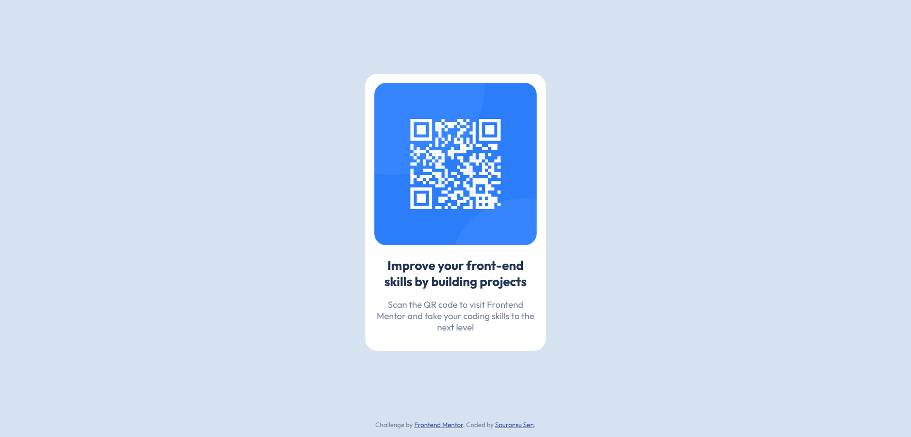

# Frontend Mentor - QR code component solution

This is a solution to the [QR code component challenge on Frontend Mentor](https://www.frontendmentor.io/challenges/qr-code-component-iux_sIO_H). Frontend Mentor challenges help you improve your coding skills by building realistic projects.

## Table of contents

- [Overview](#overview)
  - [Screenshot](#screenshot)
  - [Links](#links)
- [My process](#my-process)
  - [Built with](#built-with)
  - [What I learned](#what-i-learned)
  - [Code snippets](#code-snippets)
  - [Continued development](#continued-development)
- [Author](#author)
- [Acknowledgments](#acknowledgments)

## Overview

This is my first frontendnmentor challenge. It is a simple web page displaying a QR code. The QR code will take you to the frontendmentor website.

### Screenshot



### Links

- Solution URL: [Add solution URL here](https://your-solution-url.com)
- Live Site URL: [Add live site URL here](https://your-live-site-url.com)

## My process

### Built with

- Semantic HTML5 markup
- CSS custom properties
- Flexbox
- Mobile-first workflow

### What I learned

I have been doing CSS for some time now. It was just a basic webpage, nothing crazy. Just reinforced my knowledge of CSS custom properties, setting resets and Flexbox.

### Code snippets

For mobile-first design:

```css
@media (min-width: 400px) {
  .qr {
    min-width: 300px;
    width: 20%;
  }
}
```

The code below creates consistent gaps between elements within the "QR Code" card.

```css
.flow-content > * {
  margin-bottom: 1rem;
}
```

### Continued development

There are a lot of things I need to learn about CSS. My next target is to master CSS Grid.

## Author

- Website - [Add your name here](https://www.your-site.com)
- Frontend Mentor - [@FinalRain7751](https://www.frontendmentor.io/profile/FinalRain7751)
- Twitter - [@yourusername](https://www.twitter.com/yourusername)

## Acknowledgments

I would like to thank Kevin Powell for my progress with CSS. His YouTube videos and 'CSS Demystified' course have been of tremendous help in not only learning CSS but also in understanding all the intricacies of CSS. He made me fall in love with CSS.
